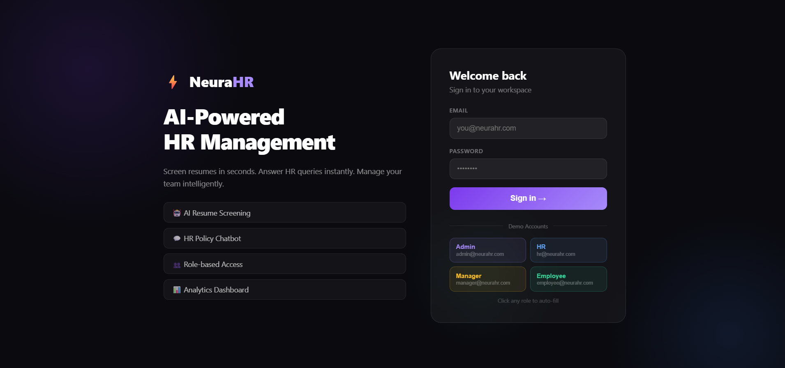
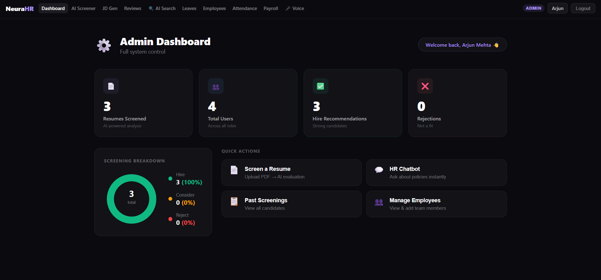
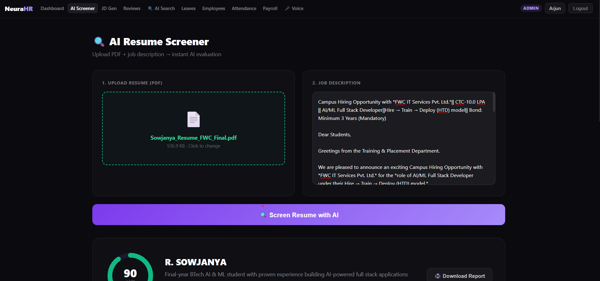
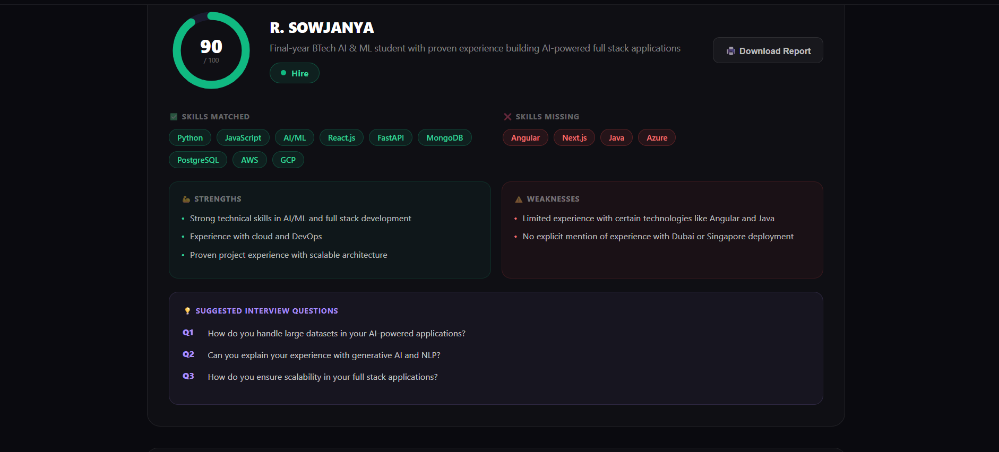
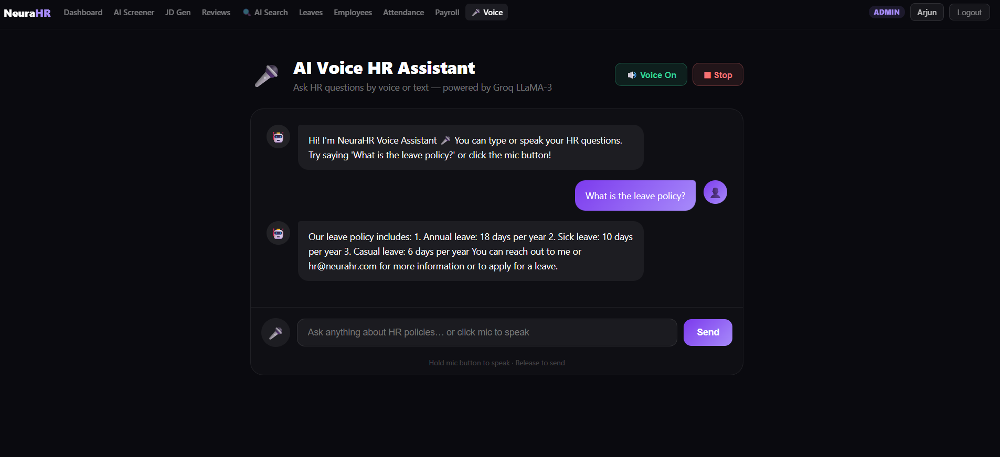
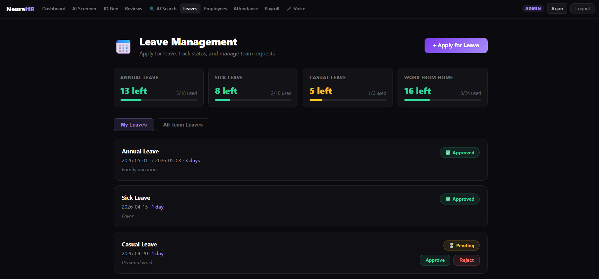
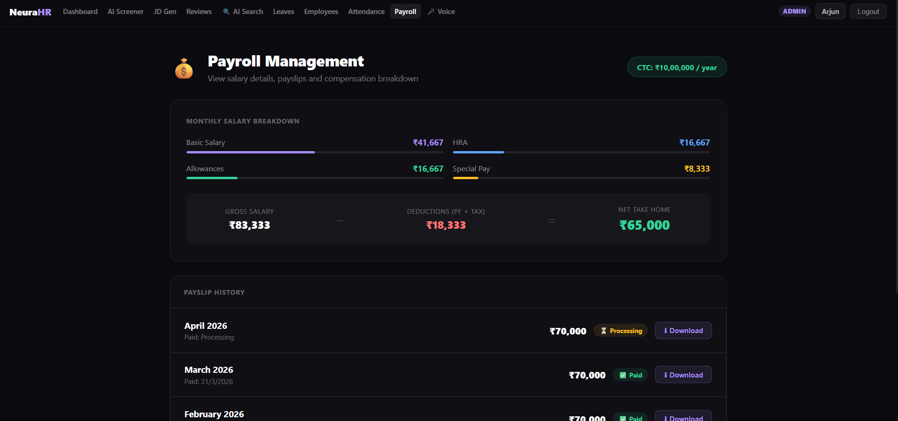

# ⚡ NeuraHR — AI-Powered HR Management System

<div align="center">

**The complete AI-powered HRMS — built for the future of work.**

[](https://neurahr-dbkevbqg3-sowjanya5751s-projects.vercel.app)
[](https://neurahr-api.onrender.com/docs)
[](https://groq.com)
[](https://vercel.com)

> 🏆 **FWC IT Services AI/ML Fullstack Hackathon 2026**
> Theme: *Build the Future of HR Management with AI-Powered Solutions*

</div>

---

## 🎬 Demo Video

> 📹 **[Watch Full Demo on Loom](https://www.loom.com/share/9c16f802b67a49e8ae00a13603cd37fd)** — AI resume screening, voice chatbot, and complete HRMS walkthrough

---

## 🌐 Live Links

| | URL |
|---|---|
| 🖥️ **Frontend** | https://neurahr-dbkevbqg3-sowjanya5751s-projects.vercel.app |
| ⚙️ **Backend API** | https://neurahr-api.onrender.com |
| 📖 **Swagger Docs** | https://neurahr-api.onrender.com/docs |

---

## 🔑 Demo — Log In Instantly

No signup needed. 4 pre-seeded accounts ready to use:

| Role | Email | Password | Access |
|------|-------|----------|--------|
| 👑 **Admin** | admin@neurahr.com | Admin123 | Full access — all 12 features |
| 👥 **HR** | hr@neurahr.com | Hr123456 | AI screening, JD generator, reviews, search |
| 📊 **Manager** | manager@neurahr.com | Mgr12345 | Performance reviews, leaves, attendance |
| 👤 **Employee** | employee@neurahr.com | Emp12345 | Leaves, payroll, attendance, voice chatbot |

---

## 📸 Screenshots

### 🔐 Login


### 📊 Admin Dashboard — with live stats and donut chart


### 🤖 AI Resume Screener — score ring + skill chips



### 🎤 AI Voice Chatbot


### 📅 Leave Management


### 💰 Payroll Dashboard


---

## ✨ Complete Feature List

### 🤖 6 AI-Powered Features

| Feature | Description |
|---------|-------------|
| **AI Resume Screener** | Upload PDF → match score, recommendation, skill gaps, interview questions |
| **AI HR Chatbot** | Text-based Q&A on all company HR policies |
| **🎤 AI Voice Assistant** | Speak your HR questions — real-time speech-to-text + text-to-speech |
| **AI JD Generator** | Enter job title → get full professional job description in seconds |
| **AI Performance Review** | Paste manager notes → get structured review with score, strengths, goals |
| **🔍 AI Smart Search** | Search employees and screenings using natural language queries |

### 🏢 Core HRMS Features

| Feature | Description |
|---------|-------------|
| **Attendance Tracker** | Clock in/out, live timer, monthly log, attendance % |
| **Payroll Management** | Salary breakdown, payslip history, downloadable payslips |
| **Performance Tracking** | Goals, quarterly scores, trend chart, add new goals |
| **Leave Management** | Apply for leave, manager approval/rejection, balance tracker |
| **Employee Management** | Searchable table, add employees, role assignment |
| **My Profile** | Personal info, HR policies, work details per user |

### 🔐 Security & Access
- JWT authentication with 24hr expiry
- 4 role-based access levels (Admin / HR / Manager / Employee)
- Route guards on both frontend and backend
- Password hashing with bcrypt

---

## 🛠 Tech Stack

| Layer | Technology | Why |
|-------|-----------|-----|
| **Frontend** | React 18 + Vite | Fast, modern, zero config |
| **Backend** | FastAPI + Python 3.10 | Async, auto Swagger docs |
| **Database** | SQLite (dev) / PostgreSQL (prod) | Zero setup locally |
| **AI** | Groq API — LLaMA 3.3 70B | Free, fast, high RPM |
| **Voice** | Web Speech API | Native browser, no extra cost |
| **Auth** | JWT + bcrypt | Stateless, secure |
| **PDF** | pdfplumber | Reliable text extraction |
| **Deploy** | Vercel + Render | CI/CD on every git push |

---

## 🏗 System Architecture

```
┌──────────────────────────────────────────────────────────────┐
│                     USER BROWSER                             │
│         React 18 + Vite — Deployed on Vercel CDN             │
│                                                              │
│  Login → Dashboard → AI Screener → Voice Bot → Payroll ...  │
└─────────────────────────┬────────────────────────────────────┘
                          │ HTTPS + JWT Bearer Token
                          ▼
┌──────────────────────────────────────────────────────────────┐
│                   FASTAPI BACKEND                            │
│                   Render.com (Free tier)                     │
│                                                              │
│  /auth          /recruitment    /chatbot    /ai              │
│  ├─ register    ├─ screen       ├─ message  ├─ generate-jd   │
│  ├─ login       ├─ results      └─ suggest  ├─ performance   │
│  ├─ me          └─ delete                   └─ smart-search  │
│  └─ users                                                    │
└──────┬──────────────┬──────────────┬──────────────┬─────────┘
       │              │              │              │
       ▼              ▼              ▼              ▼
 ┌──────────┐  ┌───────────┐  ┌──────────┐  ┌──────────┐
 │ SQLite/  │  │ Groq API  │  │pdfplumb  │  │Web Speech│
 │ Postgres │  │LLaMA 3 70B│  │   er     │  │   API    │
 └──────────┘  └───────────┘  └──────────┘  └──────────┘
```

---

## ⚡ Run Locally in 5 Minutes

### 1. Clone
```bash
git clone https://github.com/sowjanya5751/neurahr.git
cd neurahr
```

### 2. Backend
```bash
cd backend
pip install -r requirements.txt
```
Create `backend/.env`:
```env
# Get free key from: https://console.groq.com → API Keys → Create API Key
GROQ_API_KEY=your_groq_key_from_console.groq.com
JWT_SECRET=any_long_random_string_here
DATABASE_URL=sqlite:///./neurahr.db
```
```bash
uvicorn main:app --reload
# → http://localhost:8000
# → http://localhost:8000/docs  (Swagger UI)
```

### 3. Frontend
```bash
cd frontend
npm install
```
Create `frontend/.env`:
```env
VITE_API_URL=http://localhost:8000
```
```bash
npm run dev
# → http://localhost:5173
```

---

## 📡 Full API Reference

| Method | Endpoint | Role | Description |
|--------|----------|------|-------------|
| `POST` | `/auth/register` | Public | Create account |
| `POST` | `/auth/login` | Public | Login → JWT token |
| `GET` | `/auth/me` | Any | Current user info |
| `GET` | `/auth/users` | Admin | List all users |
| `POST` | `/recruitment/screen` | HR/Admin | AI resume screening |
| `GET` | `/recruitment/results` | HR/Admin | All screening results |
| `DELETE` | `/recruitment/results/{id}` | Admin | Delete a result |
| `POST` | `/chatbot/message` | Any | Send chat message |
| `GET` | `/chatbot/suggestions` | Any | Get suggested questions |
| `POST` | `/ai/generate-jd` | HR/Admin | Generate job description |
| `POST` | `/ai/performance-review` | Manager+ | Generate performance review |
| `POST` | `/ai/smart-search` | HR/Admin | Natural language search |

---

## 📁 Project Structure

```
neurahr/
├── backend/
│   ├── api/
│   │   ├── auth.py              # JWT auth, 4 roles
│   │   ├── recruitment.py       # ⭐ AI resume screening
│   │   ├── chatbot.py           # ⭐ HR chatbot
│   │   └── ai_features.py       # ⭐ JD gen, perf review, smart search
│   ├── models/models.py         # SQLAlchemy ORM
│   ├── services/
│   │   ├── groq_service.py            # Groq LLaMA integration
│   │   └── resume_parser.py     # PDF → text extraction
│   ├── database.py
│   ├── seed.py                  # Demo accounts seeder
│   ├── main.py
│   └── requirements.txt
└── frontend/src/
    ├── pages/
    │   ├── auth/Login.jsx
    │   ├── dashboard/Dashboard.jsx
    │   ├── hr/
    │   │   ├── ResumeScreener.jsx    # ⭐ AI feature
    │   │   ├── Chatbot.jsx           # ⭐ AI feature
    │   │   ├── VoiceChatbot.jsx      # ⭐ AI + Voice
    │   │   ├── JDGenerator.jsx       # ⭐ AI feature
    │   │   ├── PerformanceReview.jsx # ⭐ AI feature
    │   │   ├── AISearch.jsx          # ⭐ AI feature
    │   │   ├── Employees.jsx
    │   │   ├── LeaveManagement.jsx
    │   │   ├── Attendance.jsx
    │   │   └── Payroll.jsx
    │   ├── Profile.jsx
    │   ├── PerformanceTracking.jsx
    │   └── NotFound.jsx
    ├── components/
    │   ├── Navbar.jsx
    │   └── ProtectedRoute.jsx
    ├── context/
    │   ├── AuthContext.jsx
    │   └── ToastContext.jsx
    ├── services/api.js
    └── index.css
```

---

## 🎯 Key Design Decisions

| Decision | Reason |
|----------|--------|
| Groq over OpenAI/groq_service | Free tier, no quota issues, 10x faster |
| Web Speech API for voice | Zero cost, works natively in Chrome |
| Inline styles over Tailwind | No build config, zero class conflicts |
| SQLite for dev | Zero setup, judges can run in seconds |
| Hardcoded HR policies | Makes chatbot feel like a real product |
| 4 demo accounts pre-seeded | Judges explore every role instantly |
| Fallback on all AI features | App never fully breaks even if AI quota hits |
| Role guards frontend + backend | Production-grade, not just UI-level security |

---

## ✅ Hackathon Requirements Checklist

| Requirement | Status |
|-------------|--------|
| At least 4 AI features | ✅ 6 AI features |
| AI resume screening | ✅ |
| Multi-role login (Admin, HR, Manager, Employee) | ✅ |
| Personalized dashboards per role | ✅ |
| Attendance management | ✅ |
| Payroll management | ✅ |
| Performance tracking | ✅ |
| Leave management | ✅ |
| Mobile responsive | ✅ |
| Voice interaction | ✅ Web Speech API |
| Deployed live | ✅ Vercel + Render |
| README + architecture diagram | ✅ |
| API documentation | ✅ Swagger UI |
| Open source libraries only | ✅ |
| Free tier APIs only | ✅ Groq free tier |

---

<div align="center">

**Built by R. Sowjanya**
BTech AI & ML · MS Ramaiah University of Applied Sciences · CGPA 8.6

*12 features. 6 AI models. 4 roles. 1 deployed app.*

</div>
